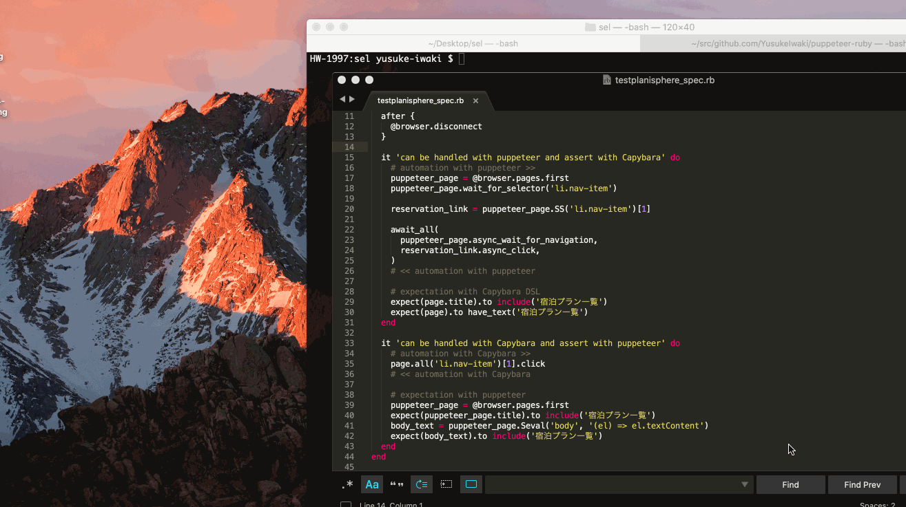

# Cooperate with Capybara

`page.find` in Capybara often fails to detect DOM as expected.
Let's be happy with `page.wait_for_selector` in Puppeteer.

## Configure

In Gemfile, add `gem "puppeteer-ruby"`, and add following configurations in spec_helper.

```ruby
require 'capybara/rspec'
require 'selenium-webdriver'
require 'puppeteer'  # <-- ADD

Capybara.register_driver :selenium_chrome_with_puppeteer do |app|
  options = Selenium::WebDriver::Chrome::Options.new

  # ADD below. If you wish headless testing, remove `headless: false`.
  Puppeteer.default_args(headless: false).each do |arg|
    options.add_argument(arg)
  end
  options.add_argument('--remote-debugging-port=9222') # <-- IMPORTANT!
  Capybara::Selenium::Driver.new(app, browser: :chrome, options: options)
end

Capybara.configure do |config|
  config.default_driver = :selenium_chrome_with_puppeteer
  config.javascript_driver = :selenium_chrome_with_puppeteer
end
```

## Using puppeteer functions

We can access `puppeteer` instance by connecting localhost:9222.
Browser is actually launched after `visit` method (defined in Capybara::DSL), so we have to put `puppeteer.connect` after the visit.

```ruby
require 'spec_helper'

RSpec.describe 'hotel.testplanisphere.dev', type: :feature do
  before {
    visit 'https://hotel.testplanisphere.dev/'

    # acquire Puppeteer::Browser instance, by connecting Chrome with DevTools Protocol.
    @browser = Puppeteer.connect(
                 browser_url: 'http://localhost:9222',
                 default_viewport: Puppeteer::Viewport.new(width: 1280, height: 800))
  }

  after {
    # release Puppeteer::Browser reesource.
    @browser.disconnect
  }

  it 'makes us happy with puppeteer' do
    # acquire Puppeteer::Page instance
    puppeteer_page = @browser.pages.first

    # ENJOY!!
    puppeteer_page.wait_for_selector('li.nav-item')
```

An example can be found at [spec/features/testplanisphere_spec.rb](spec/features/testplanisphere_spec.rb)


